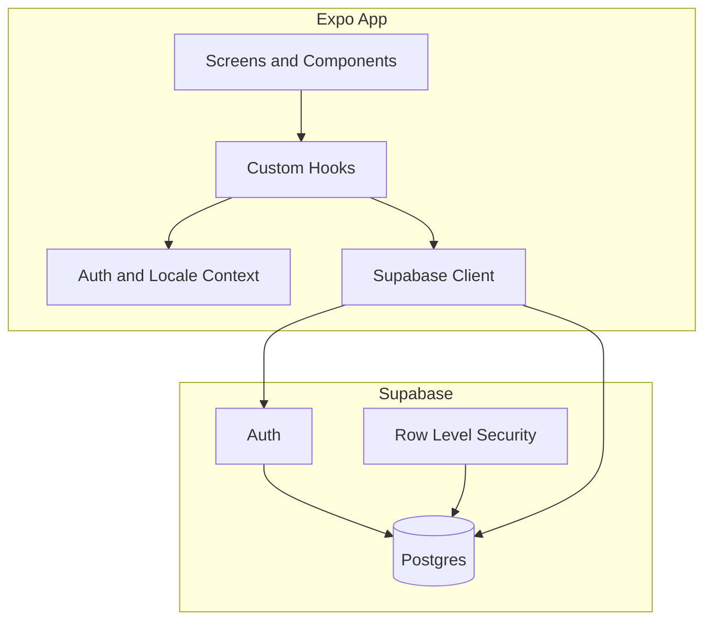

# GGDaily

A personal finance app built with Expo and Supabase to track income, expenses, budgets, and spending trends — on mobile and web.

I created GGDaily to take better control of our finances: mine and my girlfriend's. It started as a simple way to see where our money goes each month, stay within category budgets, and build healthier spending habits together.

## Features

- **Dashboard** — current balance, monthly income/expenses, budget alerts, and recent transactions
- **Transactions** — log income and expenses with search, date, and category filters
- **Categories** — manage income/expense categories with colors and optional monthly limits
- **Reports** — spending-by-category pie chart and weekly income vs. expenses bar chart
- **Budget alerts** — warnings when a category approaches or exceeds its limit
- **Settings** — language (English / Spanish), sign out, and app support link
- **First-login onboarding** — language selection with localized default categories
- **i18n** — full English and Spanish UI (default: Spanish)

## Tech Stack

| Layer | Technology |
|-------|------------|
| Framework | [Expo](https://expo.dev/) SDK 56, [React Native](https://reactnative.dev/) 0.85 |
| Language | TypeScript |
| Routing | [Expo Router](https://docs.expo.dev/router/introduction/) (file-based) |
| Backend | [Supabase](https://supabase.com/) (Auth, Postgres, RLS) |
| State / data | React Context, custom hooks |
| i18n | i18next, react-i18next, expo-localization |
| Charts | react-native-gifted-charts, react-native-svg |
| Validation | Zod |
| Package manager | pnpm |
| Builds | EAS Build (`eas.json`) |

## Architecture



### Data flow

1. **Auth** — Supabase Auth stores the session in `expo-secure-store` (native) or `localStorage` (web).
2. **Hooks** — `useTransactions`, `useCategories`, `useDashboardSummary`, etc. fetch user-scoped data via the Supabase client.
3. **RLS** — Postgres policies ensure each user only reads and writes their own rows.
4. **Locale** — `LocaleProvider` loads the saved language; first-time users complete onboarding before entering the app.

### Navigation structure

```
app/
├── index.tsx              # Landing (log in / register)
├── (auth)/                # Login, register, forgot password
└── (app)/
    ├── onboarding/        # First-login language selection
    ├── (tabs)/            # Main app (floating tab bar)
    │   ├── index          # Dashboard
    │   ├── transactions
    │   ├── categories
    │   └── reports
    ├── settings           # Language, support, sign out
    ├── transaction/       # New / edit transaction (modal)
    └── category/          # New / edit category (modal)
```

## Project Structure

```
GGDaily/
├── app/                   # Expo Router screens
├── components/
│   ├── auth/              # Login/register UI
│   ├── finance/           # Transactions, categories, charts
│   ├── navigation/      # Floating tab bar
│   └── settings/          # Language picker
├── contexts/              # Auth and locale providers
├── hooks/                 # Data fetching and derived state
├── lib/                   # Supabase, i18n, theme, validation, finance utils
├── locales/               # en.json, es.json
├── supabase/migrations/   # SQL schema and RLS
├── types/                 # Generated / hand-written DB types
├── assets/                # Icons, splash, fonts
├── app.json               # Expo config
├── eas.json               # EAS Build profiles
└── .env.example           # Environment variable template
```

## Database Schema

| Table | Purpose |
|-------|---------|
| `categories` | Income/expense categories per user (name, kind, color, optional `monthly_limit`) |
| `transactions` | Amount, description, date, linked category |

New users receive default categories (localized on first-login onboarding). A Supabase trigger seeds English names on signup; the app renames them when the user picks a language.

## Getting Started

### Prerequisites

- Node.js 18+
- [pnpm](https://pnpm.io/)
- A [Supabase](https://supabase.com/) project

### Setup

```bash
git clone https://github.com/Lermaz/GGDaily.git
cd GGDaily
pnpm install
cp .env.example .env
```

Fill in `.env`:

```env
EXPO_PUBLIC_SUPABASE_URL=https://your-project.supabase.co
EXPO_PUBLIC_SUPABASE_ANON_KEY=your_anon_or_publishable_key
```

Apply migrations from `supabase/migrations/` to your Supabase project (SQL editor or Supabase CLI).

### Run locally

```bash
pnpm start        # Expo dev server
pnpm android      # Android
pnpm ios          # iOS simulator (macOS)
pnpm web          # Web
```

### EAS Build

```bash
npm install -g eas-cli
eas login
eas build --platform android --profile production
eas build --platform ios --profile production
```

For iOS App Store builds you need an [Apple Developer Program](https://developer.apple.com/programs/) membership. Set production env vars on EAS:

```bash
eas env:create --name EXPO_PUBLIC_SUPABASE_URL --value <url> --environment production --visibility plaintext
eas env:create --name EXPO_PUBLIC_SUPABASE_ANON_KEY --value <key> --environment production --visibility plaintext
```

## Scripts

| Command | Description |
|---------|-------------|
| `pnpm start` | Start Expo dev server |
| `pnpm android` | Run on Android |
| `pnpm ios` | Run on iOS |
| `pnpm web` | Run in browser |

## License

Private project — all rights reserved.
